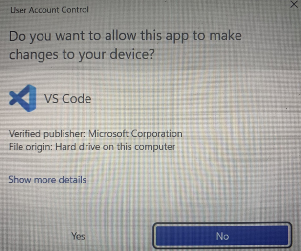
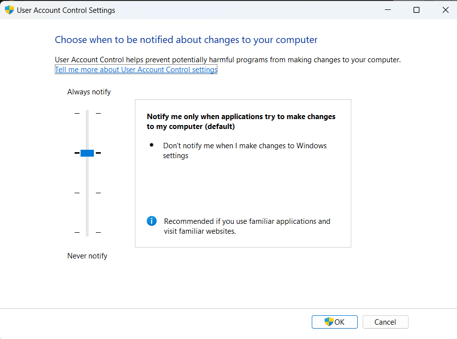
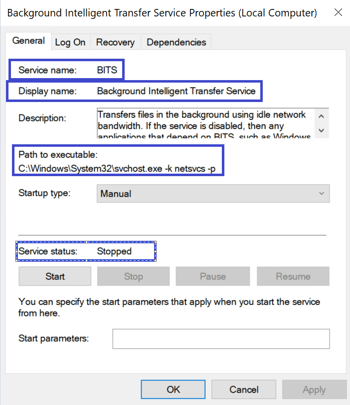
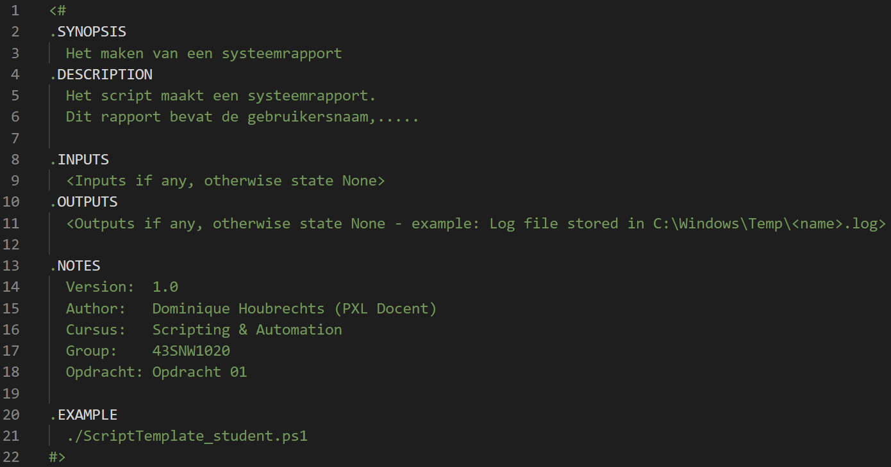
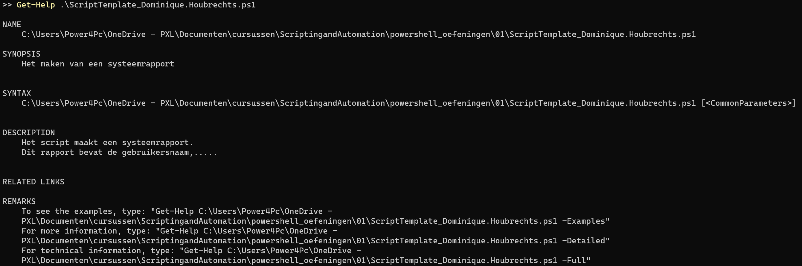
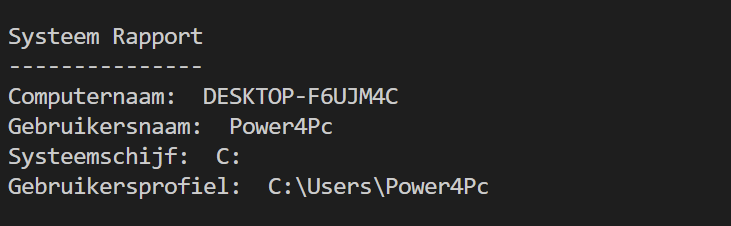
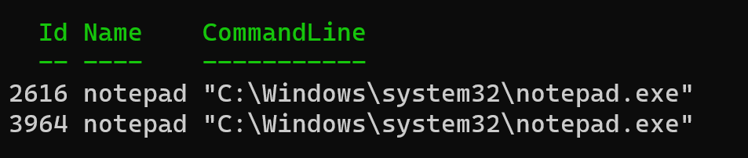

<p align="center">
  
</p>

# Extended lab 01 — PowerShell: intro, help en objecten

In deze uitgebreide lab oefen je met PowerShell, package managers, execution policies, het helpsysteem, cmdlets, aliassen, objecten en eenvoudige scripts.

> [!IMPORTANT]
> Bestaat er een PowerShell-cmdlet voor een opdracht, verkies die dan boven een extern commando.

## Leerdoelen

Na deze lab kun je:

- software zoeken, installeren en bijwerken met een package manager;
- PowerShell-versie- en execution-policy-informatie opvragen;
- cmdlets ontdekken met `Get-Help` en `Get-Command`;
- objecteigenschappen en -methoden onderzoeken met `Get-Member`;
- eenvoudige PowerShell-scripts schrijven en uitvoeren;
- processen en firewallregels beheren met PowerShell.

## Inleveren via GitHub Classroom

1. Noteer antwoorden op theorie- en opzoekvragen in een bestand `answers.md`.
2. Plaats je scripts in de map `scripts/`.
3. Gebruik betekenisvolle commitberichten en push je werk naar je Classroom-repository.
4. Voeg waar gevraagd een schermafbeelding of korte beschrijving van je testresultaat toe.

Minimaal in te leveren:

```text
answers.md
scripts/
├── Naam.ps1
├── Script_Template_JouwNaam.ps1
├── ToonEnvInfo.ps1
├── Notepad-Joke.ps1
├── Notepad-Joke-Stop.ps1
└── firewall-firefox.ps1
```

---

# Deel 1 — Introductie en installatie

## 1. Waarom scripting?

Leg in je eigen woorden uit waarom scripting nuttig is voor systeem- en netwerkbeheer. Geef minstens vier concrete voordelen of toepassingsgebieden.

## 2. Package managers

### 2.1 Wat is een package manager?

Omschrijf wat een package manager is en welke taken deze voor de gebruiker automatiseert.

### 2.2 Waarom gebruik je een package manager?

Geef minstens drie voordelen ten opzichte van handmatig software downloaden en installeren.

### 2.3 Installeer software met een package manager

Zoek en installeer de volgende software. Noteer voor elk pakket welke package manager en welke commando's je gebruikte.

#### 2.3.1 PowerShell 7.x

#### 2.3.2 Windows Terminal

#### 2.3.3 Visual Studio Code

#### 2.3.4 Een Windows-versie van het Linux-commando `grep`

#### 2.3.5 BusyBox

#### 2.3.6 Hoe werk je BusyBox bij?

## 3. PowerShell-versie

### 3.1 Toon de PowerShell-versie in je huidige sessie

Voer een commando uit dat de volledige PowerShell-versietabel toont.

### 3.2 Zoek andere manieren om de versie op te vragen

Geef minstens twee alternatieven. Vergelijk kort welke informatie ze tonen.

## 4. PowerShell execution policies

> [!CAUTION]
> Voor wijzigingen op `LocalMachine` zijn administratorrechten nodig. Verlaag de beveiliging niet zonder toestemming van de docent. Gebruik bij voorkeur `RemoteSigned` en herstel de oorspronkelijke instelling na de oefening.

### 4.1 Controleer de actieve execution policy

### 4.2 Toon de execution policies voor alle scopes

Neem minstens `MachinePolicy`, `UserPolicy`, `Process`, `CurrentUser` en `LocalMachine` op in je antwoord.

### 4.3 Stel de policy voor `LocalMachine` in

Met welk commando stel je de execution policy voor de scope `LocalMachine` in op `RemoteSigned`? Hoe zou het commando voor `Unrestricted` eruitzien?

### 4.4 Zoek help over execution policies

Gebruik het PowerShell-helpsysteem om algemene informatie en gedetailleerde cmdlet-informatie te vinden.

### 4.5 Zoek help over één parameter

Welke parameter van `Get-Help` gebruik je om alleen informatie over de parameter `ExecutionPolicy` van `Set-ExecutionPolicy` te tonen?

## 5. PowerShell gebruiken in Visual Studio Code

Zorg ervoor dat je PowerShell-scripts kunt schrijven en uitvoeren in Visual Studio Code.

> [!TIP]
> Zoek naar een geschikte extensie in de Extensions-weergave van Visual Studio Code.

Noteer welke extensie je installeerde en hoe je controleerde dat ze werkt.

## 6. Eerste script: `Naam.ps1`

Maak `scripts/Naam.ps1`. Het script vraagt geen invoer en toont je naam en woonplaats.

Voorbeeld:

```text
PS> .\scripts\Naam.ps1
Naam: Dominique Houbrechts
Woonplaats: Kortessem
```

### 6.1 Voer het script op twee manieren uit

Voer het script uit:

1. in een command shell, bijvoorbeeld Windows Terminal;
2. vanuit Visual Studio Code.

### 6.2 Hernoem het script

Hernoem `Naam.ps1` naar `Mijn Naam.ps1` en voer het opnieuw uit vanuit Windows Terminal en Visual Studio Code. Noteer waarom je het pad anders moet invoeren wanneer de bestandsnaam een spatie bevat.

## 7. Visual Studio Code starten als administrator

Maak twee snelkoppelingen waarmee je Visual Studio Code als administrator kunt starten zonder bij elke start de volgende UAC-melding te krijgen.



Wijzig de aanbevolen instelling van User Account Control niet.



Beschrijf de gekozen werkwijze en test beide snelkoppelingen.

---

# Deel 2 — Help, cmdlets en objecten

## 8. Help over processen

### 8.1 Zoek help met de algemene zoekterm `process`

Gebruik alleen het PowerShell-helpsysteem.

### 8.2 Vraag meer gedetailleerde informatie op

Toon hoe je gedetailleerde, volledige en online help voor een specifieke process-cmdlet kunt openen.

## 9. Cmdlets ontdekken met `Get-Command`

### 9.1 Geef een overzicht van alle cmdlets

### 9.2 Leg de volgende opdrachten uit

#### 9.2.1 `Get-Command -Name *process*`

#### 9.2.2 `Get-Command -Noun Process`

#### 9.2.3 `Get-Command -Verb Get -Noun Process`

#### 9.2.4 `Get-Command -Verb Out`

## 10. Processen en PowerShell-objecten

### 10.1 Welke twee cmdlets gebruik je om informatie over processen te zoeken?

### 10.2 Welke cmdlet vraagt alle systeemprocessen op?

### 10.3 Hoe open je de online help van deze cmdlet?

### 10.4 Hoe toon je alleen de syntaxis van deze cmdlet?

### 10.5 Hoe toon je help over de parameter `Id`?

### 10.6 Hoe toon je alle properties van de uitgevoerde processen?

### 10.7 Hoe toon je alle methods van de uitgevoerde processen?

## 11. Verschil tussen `Get-Help` en `Get-Command`

### 11.1 `Get-Help`

Leg uit welke informatie deze cmdlet gebruikt en toont.

### 11.2 `Get-Command`

Leg uit welke informatie deze cmdlet gebruikt en toont.

## 12. Service-informatie als PowerShell-output

Gebruik PowerShell om de aangeduide informatie over de service **BITS** te tonen: servicenaam, weergavenaam, pad naar het uitvoerbare bestand en status.



## 13. Zoek de PowerShell-opdracht achter `dir`

Zoek op minstens twee manieren welke PowerShell-opdracht overeenkomt met `dir` in Windows.

## 14. Maak de terminal leeg

Gebruik de lokale PowerShell-help, niet het internet, om te vinden hoe je het scherm leegmaakt.

### 14.1 Welke aliassen kun je hiervoor gebruiken?

## 15. Geef een overzicht van alle aliassen

Toon alle aliassen die in je huidige PowerShell-sessie beschikbaar zijn.

## 16. Maak een script met comment-based help

Maak `scripts/Script_Template_JouwNaam.ps1` op basis van de volgende structuur. Vervang `JouwNaam` eventueel door je eigen naam, zonder tekens die niet in een Windows-bestandsnaam zijn toegestaan.



Voer daarna uit:

```powershell
Get-Help .\scripts\Script_Template_JouwNaam.ps1
Get-Help .\scripts\Script_Template_JouwNaam.ps1 -Full
```



### 16.1 Wat is het doel van comment-based help?

## 17. Tekst naar het scherm sturen

Toon de volgende tekst met een PowerShell-cmdlet:

```text
Welkom bij PXL!!!
```


### 17.1 Wat is het verschil tussen `Write-Output` en `Write-Host`?

### 17.2 Zet de tekst om naar hoofdletters

Stuur dezelfde tekst in hoofdletters naar het scherm zonder de tekst zelf in hoofdletters in je opdrachtregel te schrijven.


> [!TIP]
> Zoek naar strings, types, methods en `ToUpper`.

## 18. Omgevingsvariabelen

Zoek met PowerShell hoe je omgevingsvariabelen gebruikt. Toon vervolgens:

### 18.1 De computernaam (`COMPUTERNAME`)

### 18.2 De gebruikersnaam (`USERNAME`)

### 18.3 De systeemschijf (`SYSTEMDRIVE`)

### 18.4 Het gebruikersprofiel (`USERPROFILE`)

Voorbeeld: `C:\Users\Dominique`.

### 18.5 Maak `ToonEnvInfo.ps1`

Maak `scripts/ToonEnvInfo.ps1`. Het script maakt eerst het scherm leeg en toont daarna een systeemrapport met de vier waarden.

Verwachte uitvoer:



## 19. Processen starten en stoppen

> [!CAUTION]
> Sluit je bestaande Notepad-sessies voordat je deze oefening uitvoert. Het stopscript sluit alle processen met de naam `notepad`.

Maak `scripts/Notepad-Joke.ps1` dat vier Notepad-vensters opent.

### 19.1 Hoe start je Notepad met een cmdlet?

### 19.2 Hoe toon je alle actieve Notepad-processen?

### 19.3 Toon `Id`, `Name` en `CommandLine`

Zorg voor vergelijkbare uitvoer:



### 19.4 Hoe sluit je Notepad-processen met een cmdlet?

### 19.5 Maak `Notepad-Joke-Stop.ps1`

Maak `scripts/Notepad-Joke-Stop.ps1` dat alle geopende Notepad-processen afsluit.

### 19.6 Open de vensters gemaximaliseerd

Wijzig `Notepad-Joke.ps1` zodat de Notepad-vensters gemaximaliseerd openen.

## 20. Firewalloefening — Firefox

> [!CAUTION]
> Deze oefening wijzigt de Windows Firewall en vereist administratorrechten. Voer ze alleen uit op het aangewezen labsysteem. Verwijder je testregel aan het einde.

Maak `scripts/firewall-firefox.ps1` waarmee je:

1. het pad naar `firefox.exe` vindt;
2. een uitgaande firewallregel maakt die Firefox blokkeert;
3. de regel opvraagt en controleert;
4. de regel uitschakelt en opnieuw inschakelt;
5. de regel verwijdert.

> [!TIP]
> Zoek via PowerShell-help naar `NetFirewallRule`. Via `wf.msc` kun je het resultaat ook grafisch controleren.

---

## Eindcontrole

- [ ] Alle theorievragen staan in `answers.md`.
- [ ] Alle zes scripts staan in `scripts/`.
- [ ] De scripts voeren uit zonder syntaxfouten.
- [ ] De firewallregel is na de test verwijderd.
- [ ] Alle bestanden zijn gecommit en gepusht naar GitHub Classroom.
